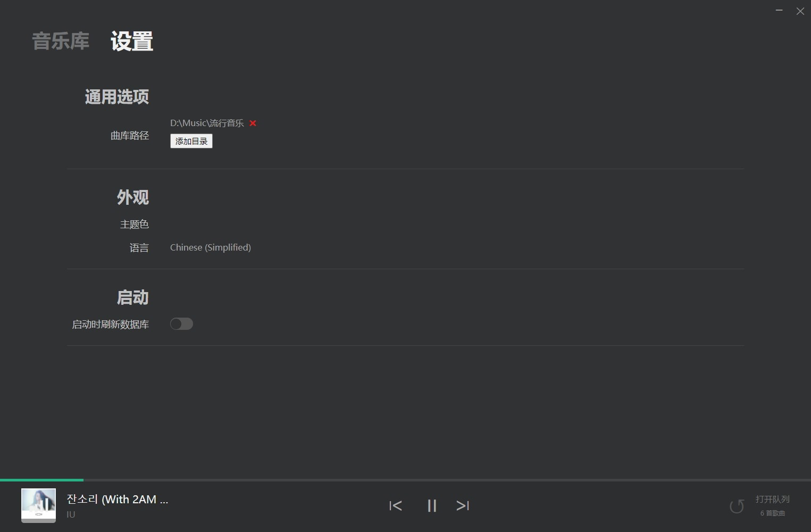
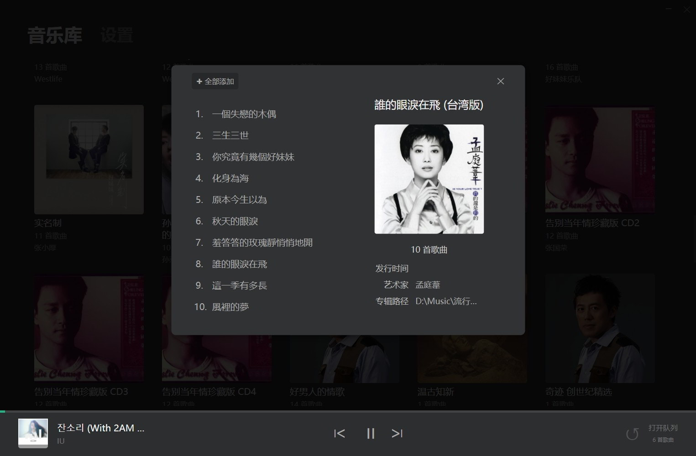

# Horen

Horen 是一个用 React 和 electron 打造的本地音乐播放器，正在不断开发中

There is another lite edition, you will like it! https://github.com/horenjs/horen-lite


## 预览图

### 曲库界面


### 设置界面



### 专辑预览



### 播放列表


### 正在播放（歌词显示）


## 功能进度

- [x] 主体界面
- [x] 当前播放
- [x] 播放队列
- [x] 控制播放进度
- [x] 设置界面
- [x] 控制音量
- [X] 歌词显示
- [ ] 调音器
- [x] 播放主界面

## 优化

- [x] 不一次性读取所有音频 避免内存占用过高

## 开发

```bash
git clone https://github.com/kevinjobs/Horen.git

cd Horen

# then
npm install

# start the app
npm run start

# build the app
npm run build

# package
npm run dist
```

## LICENSE

Apache License Version 2.0
