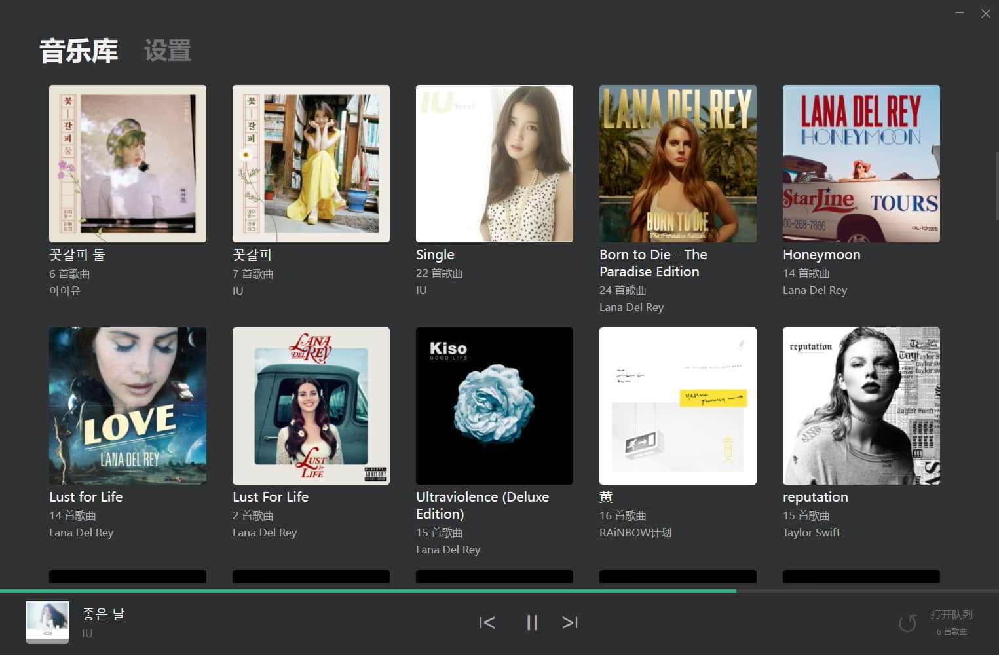
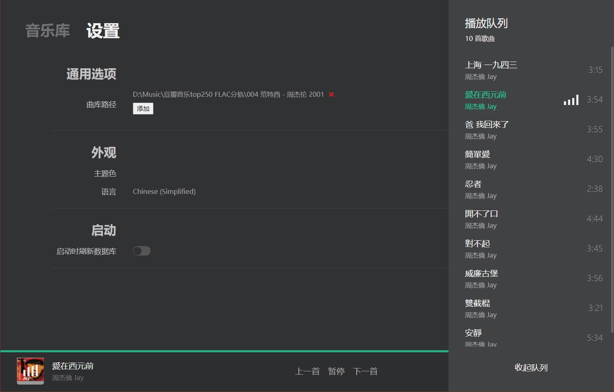

<!--
 * @Author       : Kevin Jobs
 * @Date         : 2022-01-19 23:40:05
 * @LastEditTime : 2022-01-27 23:34:49
 * @lastEditors  : Kevin Jobs
 * @FilePath     : \horen\README.md
 * @Description  : 
-->
# Horen

Horen 是一个用 React 和 electron 打造的本地音乐播放器，正在不断开发中

## 预览图

### 曲库界面



### 设置界面



## 功能进度

- [x] 主体界面
- [x] 当前播放
- [x] 播放队列
- [x] 控制播放进度
- [x] 设置界面
- [ ] 控制音量
- [ ] 歌词显示
- [ ] 调音器
- [ ] 播放主界面


## 开发

```bash
git clone https://github.com/kevinjobs/Horen.git

cd Horen

# if you don't install pnpm
npm i -g pnpm

# then
pnpm install

# start the app
pnpm start --filter horen
```

## LICENSE

Apache License Version 2.0
